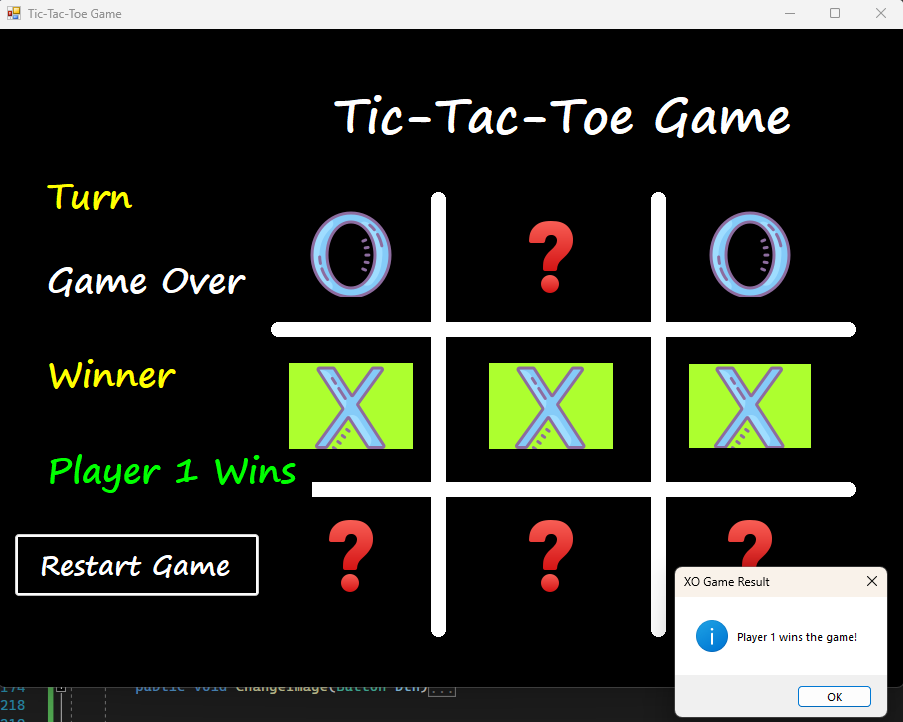

# ❌⭕ XO Game (Tic Tac Toe) — C# Windows Forms

A classic **Tic Tac Toe (XO)** game built using **C# Windows Forms (.NET Framework)** with a clean and structured implementation of game logic and event-driven programming.

This project focuses on building a simple game while applying **software design principles, state management, and UI interaction handling**.

---

## 🎮 Game Overview

XO is a two-player turn-based game where players take turns marking **X** and **O** on a 3x3 grid.

### 🏆 Winning Conditions:
A player wins if they successfully place three of their symbols in:
- A horizontal row
- A vertical column
- A diagonal line

If all cells are filled without a winner, the result is a **draw**.

---

## ✨ Features

- 👥 Two-player local gameplay
- 🔄 Turn-based system (Player 1 / Player 2)
- 🧠 Automatic win detection (rows, columns, diagonals)
- 🤝 Draw detection
- 🎯 Highlight winning cells
- 🔁 Restart game functionality
- ⚡ Single event handler for all buttons (clean architecture)
- 🧼 Centralized game logic
- 🪟 Windows Forms interactive UI
- 🎨 Custom board drawing using GDI+

---

## 🧠 Architecture & Design

The project is structured using a simple state-based design:

### 🎮 Game State Management
- `enPlayer` → Tracks current player turn
- `enWinner` → Stores game result (Player1 / Player2 / Draw / InProgress)
- `stGameStatus` → Holds overall game status (winner, game over, move count)

---

### ⚙️ Core Functions

- `ChangeImage(Button btn)`  
  Handles player moves and updates UI state.

- `CheckWinner()`  
  Evaluates all possible winning combinations.

- `CheckValues(Button b1, Button b2, Button b3)`  
  Checks if three cells contain the same symbol.

- `EndGame()`  
  Displays result and locks the game.

- `RestartGame()`  
  Resets the board and restores initial state.

---

## 🔄 Game Flow

1. Player clicks an empty cell
2. X or O is placed
3. Game state updates
4. Win condition is checked
5. If a player wins → game ends immediately
6. If all cells are filled → draw
7. Otherwise → next player's turn

---

## 🛠️ Technologies Used

- C#
- Windows Forms (.NET Framework)
- Visual Studio
- GDI+ (Graphics for board drawing)

---

## 📚 Key Learning Outcomes

This project demonstrates:

- Event-driven programming in C#
- State management in games
- UI interaction handling in WinForms
- Clean and reusable function design
- Separation of logic and UI behavior
- Basic game development structure

---

## 🚀 How to Run

1. Open the solution in **Visual Studio**
2. Build the project
3. Run the application (`F5`)
4. Enjoy the game 🎮

---

## 🚀 Future Improvements

- 🤖 AI opponent (Easy / Hard mode)
- 🧠 Minimax algorithm implementation
- 📊 Score tracking system
- 🎨 Modern UI redesign (dark mode / animations)
- 🔊 Sound effects for moves
- 📱 Cross-platform version (MAUI / Flutter)

---
## 📸 Preview

  

  XO Game built with C# Windows Forms

---

## 👨‍💻 Author

Developed as a learning project to practice:
- C# fundamentals
- Windows Forms development
- Game logic implementation

---

## 📄 License

This project is free to use for educational and learning purposes.
